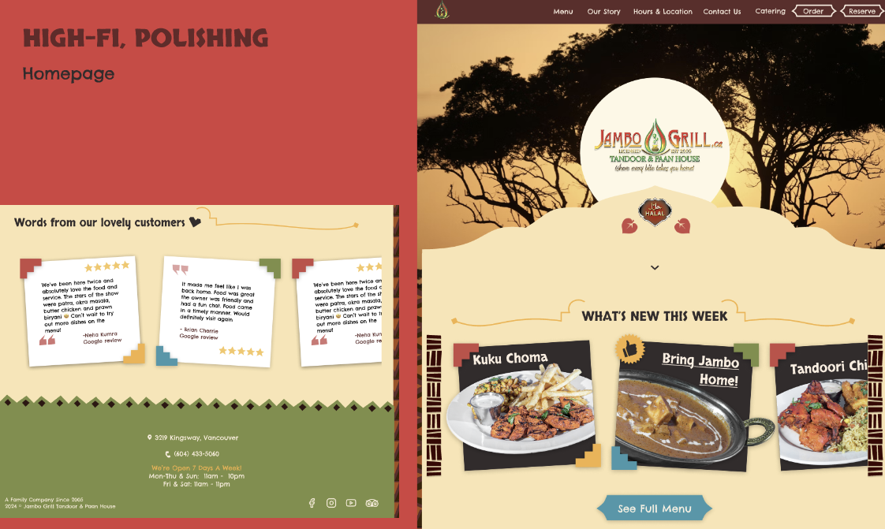
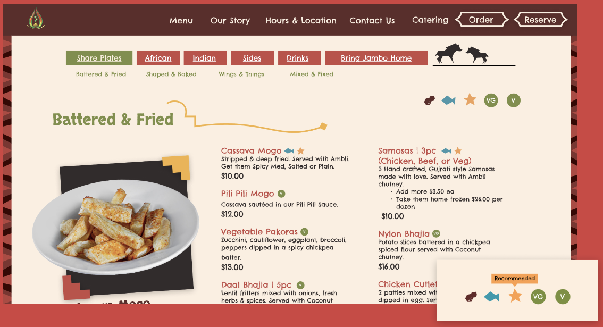
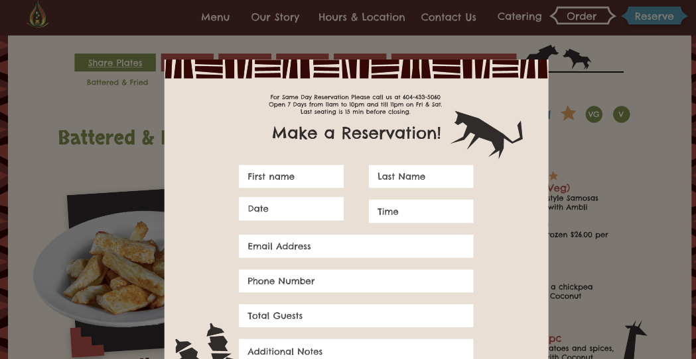
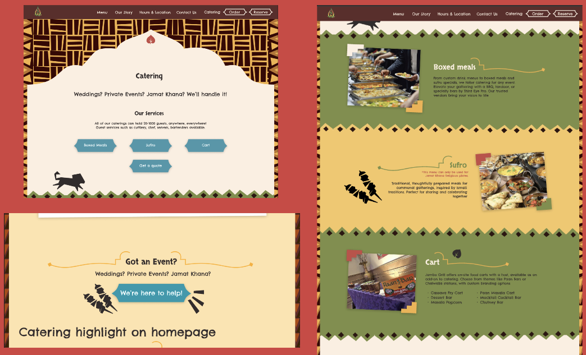
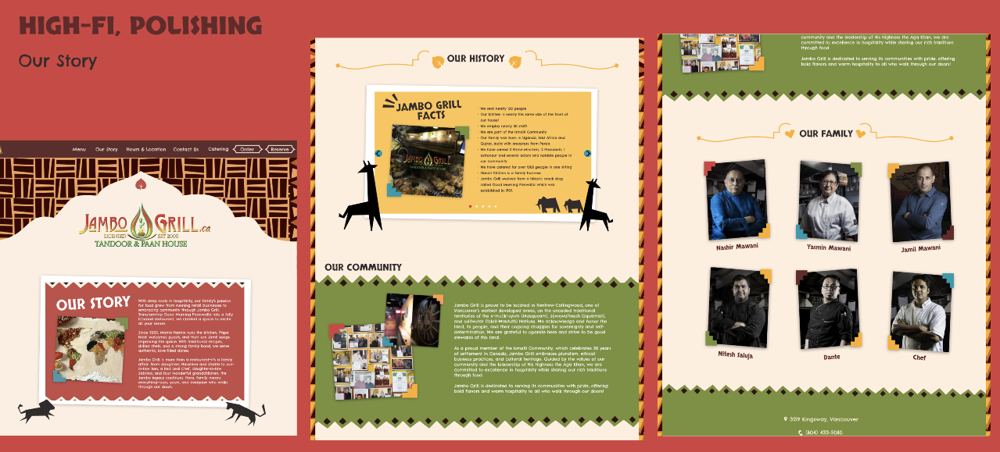
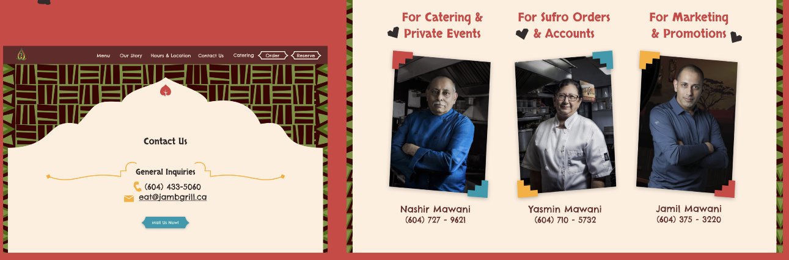
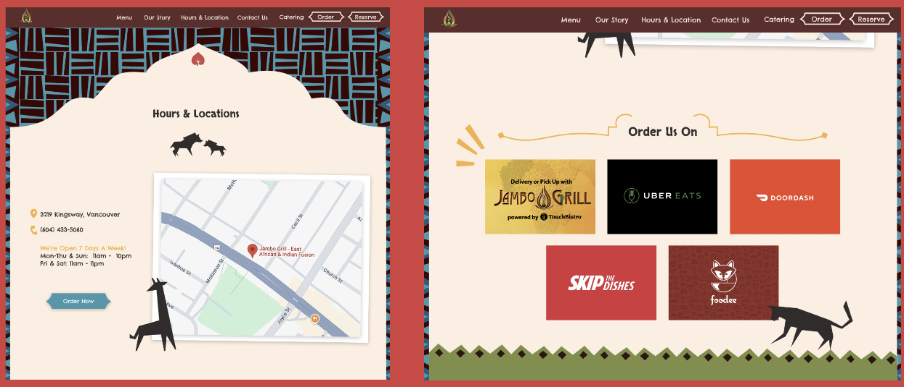

# Jambo Grill Website Redesign

## Overview
This project was completed during the FLUI Design Hackathon in a team of four. We redesigned the website for Jambo Grill, a Vancouver-based fusion restaurant, with the goal of improving usability while preserving its strong cultural identity.

Working within a limited timeframe, we applied a user-centered design approach to create a more accessible, visually cohesive, and engaging digital experience.

---

## About the Client
Jambo Grill is a fusion restaurant combining East African, Indian, and Persian influences with a Canadian perspective. The restaurant emphasizes cultural storytelling through food and offers Halal, vegan, and vegetarian options.

A key challenge identified was attracting more local customers, despite having a strong out-of-town customer base.

---

## Problem
The existing website presented several usability challenges:
- Difficult navigation due to unstructured content
- Key information (menu, services) was hard to find
- Limited reflection of the restaurant’s cultural identity in the UI
- Lack of visual hierarchy and accessibility considerations

---

## Goal
Design a website that:
- Reflects the restaurant’s cultural heritage and brand values
- Improves accessibility and usability
- Makes key information (menu, services) easy to find
- Creates a visually engaging experience for local users

---

## My Contributions
- Participated in user research and analysis (personas, user journeys, usability feedback)
- Contributed to wireframing and design ideation
- Helped develop visual direction, including layout and UI decisions
- Collaborated on prototyping (lo-fi to high-fi) in Figma
- Worked closely with teammates to refine designs under time constraints

---

## Design Process

### 1. Research & Analysis
- Created personas and user journeys to identify pain points
- Conducted card sorting and user testing to understand how users organize information
- Performed SWOT and competitor analysis to identify opportunities
- Developed a mood board to guide visual direction

---

### 2. Information Architecture
- Designed a sitemap to restructure the website
- Simplified navigation and reduced redundant content
- Prioritized key pages such as menu, services, and contact information

---

### 3. Wireframing & Prototyping
- Each team member created initial wireframes
- Combined and refined ideas into a unified design
- Developed:
    - Low-fidelity prototype (structure & layout)
    - Mid-fidelity prototype (interaction & flow)
    - High-fidelity design (final visuals)

---

## Key Design Decisions

### Cultural Identity
- Integrated African, Indian, and Persian design elements
- Incorporated proverbs, patterns, and cultural motifs
- Preserved the restaurant’s storytelling aspect through visuals

### Visual Design
- Used bold color blocks and refined the existing palette
- Applied asymmetry and geometric layouts for a dynamic feel
- Designed custom visual assets aligned with the brand

### Usability & Accessibility
- Improved navigation and content hierarchy
- Made key information (menu, services) easily accessible
- Designed with clarity, readability, and user flow in mind

---

## Outcome
The redesigned website:
- Better reflects the restaurant’s unique cultural identity
- Improves ease of navigation and information discovery
- Creates a more engaging and user-friendly experience
- Aligns branding with usability to attract local customers

---

## Key Takeaways
- Balanced branding and usability in a real-world design scenario
- Designed under tight time constraints, prioritizing high-impact improvements
- Strengthened skills in collaboration, iteration, and design decision-making
- Applied user-centered design principles in a fast-paced environment