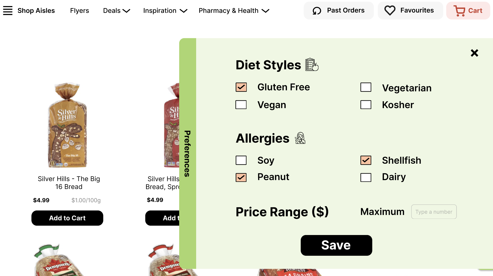
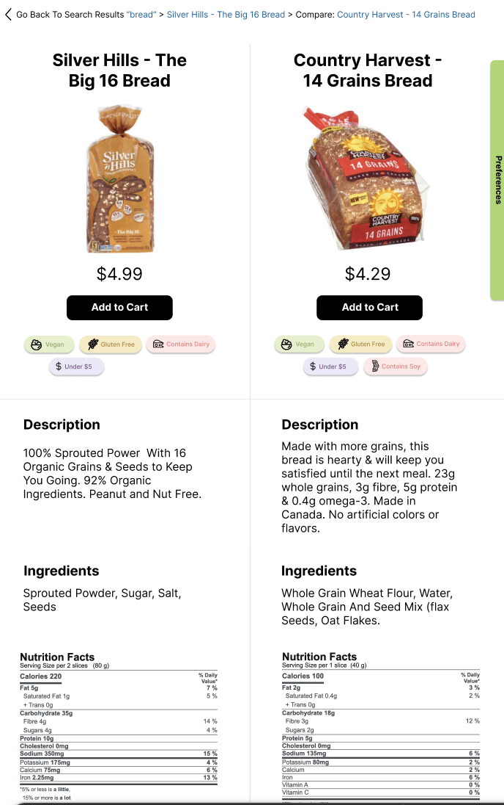

# Save-On-Foods Website Redesign

## Overview
This project was completed as part of a Human-Computer Interaction (HCI) course in a team of six. The goal was to redesign the Save-On-Foods online shopping experience to better support users with dietary restrictions, particularly those with allergies.

We focused on improving how users discover safe products by introducing 
features for allergy-aware filtering and side-by-side product comparison.

---

## Problem
Online grocery platforms often make it difficult for users with allergies to:
- Quickly identify safe products
- Compare ingredients across items
- Filter products based on dietary needs

This creates friction and increases the risk of unsafe purchasing decisions.

---

## Solution
We designed and evaluated a prototype with two key features:

### 1. Preference-Based Filtering
- Allows users to set dietary preferences (e.g., allergies, budget)
- Filters search results and recommendations accordingly
- Designed to reduce cognitive load and save time

### 2. Product Comparison Tool
- Enables side-by-side comparison of two items
- Uses category tags (e.g., allergens, ingredients) for quick scanning
- Helps users make safer, more informed decisions without reading long descriptions

---

## My Contributions
- Contributed to user research, including interviews and study design
- Helped design wireframes and interaction flows in Figma
- Conducted usability testing sessions
- Contributed to analysis of qualitative data
- Iterated on design decisions based on user feedback and HCI principles

---

## Research & Evaluation

### Methodology
- 7 participants across diverse age groups
- Remote usability testing via Zoom
- Think-aloud protocol + semi-structured interviews
- Affinity diagramming for qualitative analysis

### Key Findings
- Comparison tool (rated 4.14/5 usefulness):
    - Highly effective for decision-making
    - Category tags significantly reduced reading time

- Preference filtering:
    - Very useful when discovered
    - Helped users quickly eliminate irrelevant items

- Main usability issue:
    - Preference feature had low discoverability (57% missed it)

---

## Design Decisions
- Applied user-centered design and iterative prototyping
- Reduced cognitive load through progressive disclosure and visual tagging
- Designed for accessibility and clarity, especially for high-risk users (allergies)
- Balanced information density vs. usability in comparison views

---

## Prototype Walkthrough
A medium-fidelity prototype walkthrough demonstrating key features and user flows:

---

## Improvements & Future Work
- Improve discoverability of preference filters (e.g., repositioning, onboarding prompts)
- Add clearer visual cues for scrollable content
- Expand filtering to integrate directly into search behavior
- Recruit more users with real dietary restrictions for evaluation

---

## Tools
- Figma (prototyping)
- Zoom (remote testing)
- Miro (affinity mapping & analysis)
